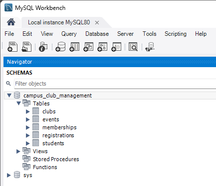
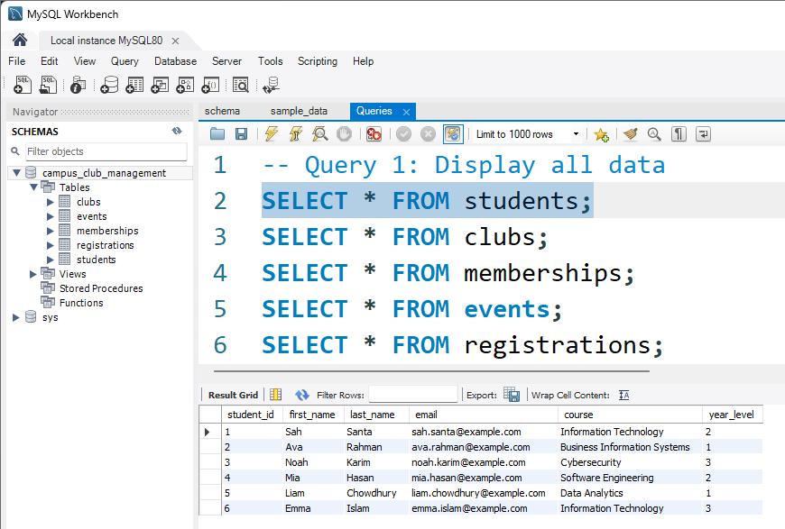
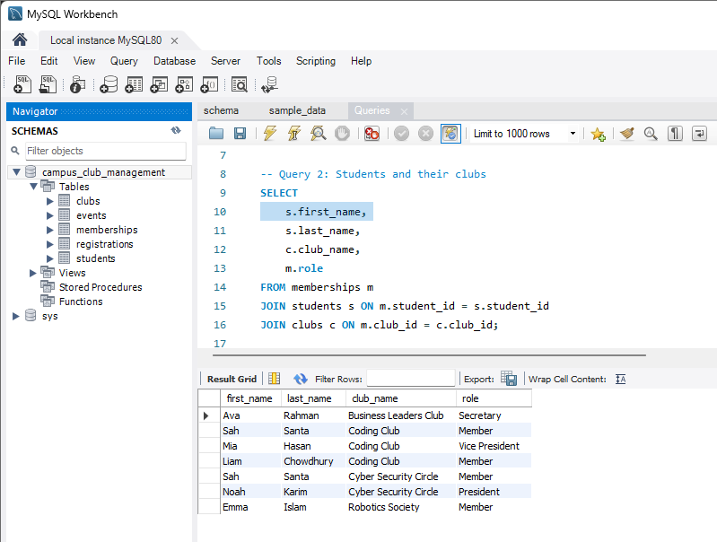
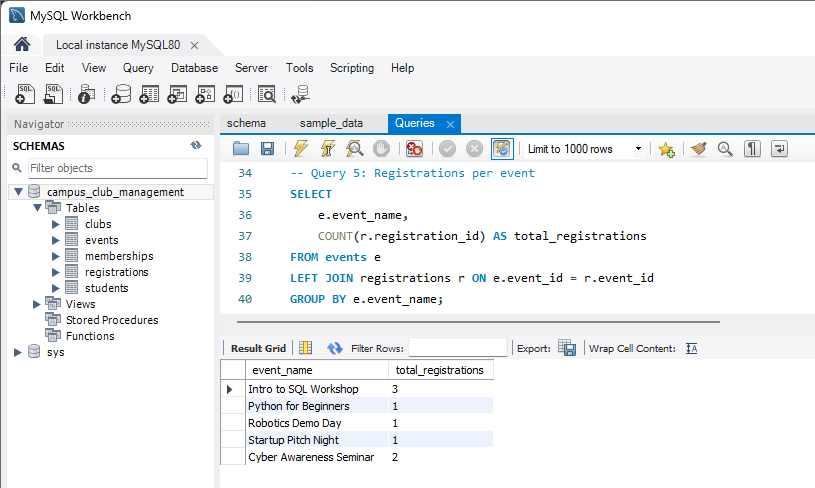
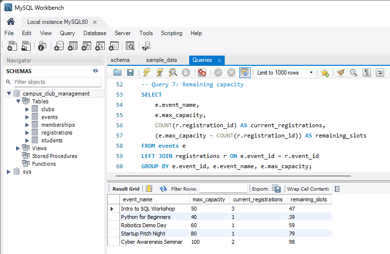
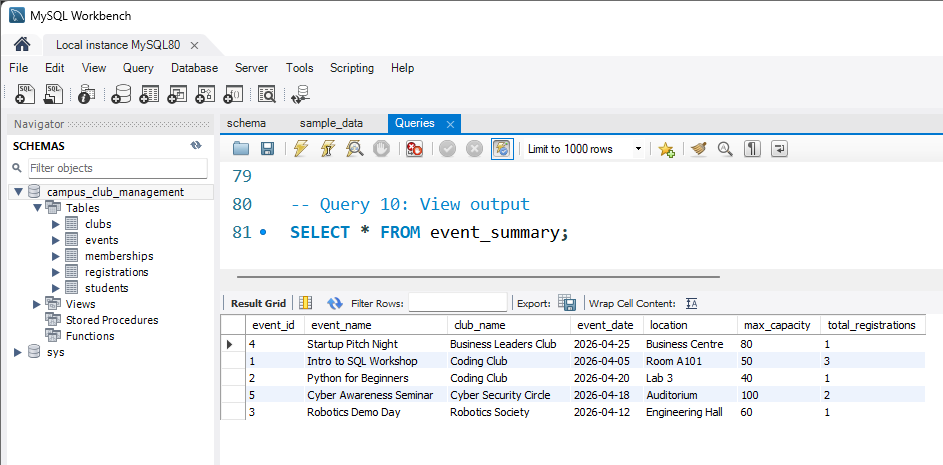

# A beginner SQL project demonstrating relational database design and data analysis using MySQL.
# Campus Club & Event Management System (MySQL)

## Overview
This project is a student SQL portfolio project built using MySQL Workbench. It manages students, clubs, memberships, events, and registrations.

## Features
- Relational database design
- Multiple related tables
- Joins, aggregation, filtering
- View creation
- Data analysis queries

## Tools Used
- MySQL Server
- MySQL Workbench

## Tables
- students
- clubs
- memberships
- events
- registrations

## Key Queries
- Students and their clubs
- Event participation
- Most popular club
- Remaining event capacity
- Students attending events

## Screenshots

## Author
Sah Amran Santa
